# Software Design Document (SDD)

## 1. Introduction

This document describes the software design of the Moderation System for the
Restaurant Review Platform. It presents the overall architecture, major software
components, database design, API design, and the interactions between system
components.

The functional and non-functional requirements are defined in the Software
Requirements Specification (SRS) and are not repeated in this document.

### 1.1 Definitions, Acronyms, and Abbreviations

| Acronym | Definition                          |
| ------- | ----------------------------------- |
| API     | Application Programming Interface   |
| CRUD    | Create, Read, Update, Delete        |
| ERD     | Entity Relationship Diagram         |
| JWT     | JSON Web Token                      |
| ORM     | Object-Relational Mapper            |
| REST    | Representational State Transfer     |
| SDD     | Software Design Document            |
| SRS     | Software Requirements Specification |
| UI      | User Interface                      |
| UML     | Unified Modeling Language           |
| UX      | User Experience                     |

### 1.2 References

1. IEEE Std 1016 – IEEE Standard for Software Design Description.
2. Software Requirements Specification (SRS) for the Restaurant Review Platform.
3. Project source code repository.

## 2. Design Overview

The Moderation System is designed as a modular backend application that provides
restaurant verification, report management, content moderation, customer
support, and moderation administration.

The system adopts a layered architecture to separate request handling, business
logic, data access, and data storage. This organization keeps the implementation
modular and simplifies future maintenance.

### 2.1 Architectural Style

The Moderation System follows a layered architecture consisting of the following
layers:

- API Layer
- Service Layer
- Repository Layer
- Database Layer

Each layer performs a specific function and communicates only with the adjacent
layers.

### 2.2 Technology Stack

The Moderation System is implemented using the following technologies.

| Category        | Technology |
| --------------- | ---------- |
| Language        | TypeScript |
| Framework       | Express.js |
| Database        | PostgreSQL |
| ORM             | Prisma ORM |
| Validation      | Zod        |
| Authentication  | JWT        |
| Package Manager | pnpm       |

## 3. System Architecture

This section presents the architecture of the Moderation System and describes
the purpose of each software layer.

### 3.1 Layered Architecture

The following diagram illustrates the layered architecture of the Moderation
System.

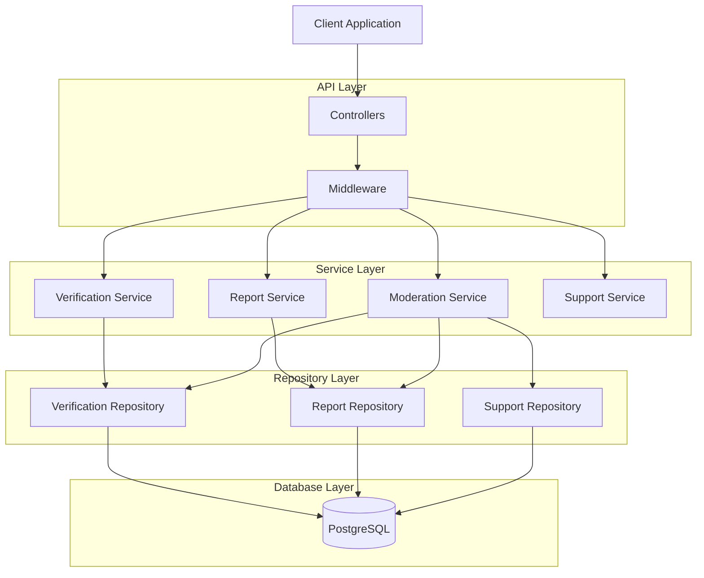

### 3.2 Layer Description

#### API Layer

Receives client requests and forwards them to the appropriate service for
processing.

#### Service Layer

Implements the business logic and coordinates interactions between repositories
and other services.

#### Repository Layer

Provides a consistent interface for accessing and modifying persistent data.

#### Database Layer

Stores all moderation-related data, including reports, restaurant verification
status, moderation records, and customer support data.

## 4. Component Design

This section describes the major components of the Moderation System. Each
component performs a specific function and collaborates with other components
through well-defined interfaces.

The Moderation System consists of the following components:

- Restaurant Verification
- Media Moderation
- Review Moderation
- Report Management
- Customer Support Management

### 4.1 Restaurant Verification

**Overview**

The Restaurant Verification component automatically verifies restaurants based
on customer reviews. Verification is performed automatically using predefined
business rules and does not require moderator intervention.

**Design**

Every newly created restaurant is assigned an **Unverified** status.

Whenever a user submits a new review, the component evaluates the restaurant
against the verification criteria. If all conditions are satisfied, the
restaurant status is updated to **Verified**.

Verification is performed only once. After a restaurant has been verified,
subsequent review updates or deletions do not trigger another verification
process.

**Verification Criteria**

A restaurant is verified when all of the following conditions are met:

- The restaurant has received at least five reviews.
- The reviews are submitted by at least five different users.
- The average rating is greater than or equal to 2.5.

**Interactions**

The component interacts with:

- Restaurant Management
- Review Management
- Database

**Component Diagram**

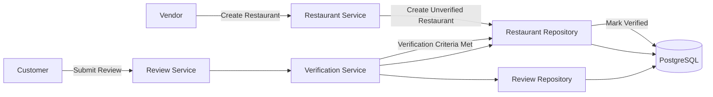

### 4.2 Media Moderation

**Overview**

The Media Moderation component is responsible for reviewing images uploaded by
users and vendors. It enables moderators to identify content that violates
platform policies and apply the appropriate moderation actions.

**Design**

When media is uploaded or reported, the component retrieves the media for
moderator review. Moderators inspect the content and determine whether it
complies with the platform guidelines.

If the media violates the moderation policies, the moderator may remove the
media and record the moderation decision. Otherwise, the media remains available
on the platform.

**Moderation Actions**

The component supports the following actions:

- Approve media.
- Remove media.
- Record moderation notes.

**Interactions**

The component interacts with:

- User Management
- Restaurant Management
- Report Management
- Database

**Component Diagram**

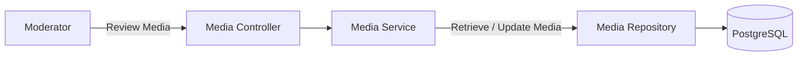

### 4.3 Review Moderation

**Overview**

The Review Moderation component allows moderators to review customer reviews and
enforce the platform's review policies. It provides the necessary functionality
to investigate reported reviews and apply moderation decisions.

**Design**

When a review is reported, the component retrieves the review and its associated
information for moderator inspection.

After evaluating the review, the moderator determines the appropriate moderation
action. The selected action is applied, and the moderation decision is recorded
for auditing purposes.

**Moderation Actions**

The component supports the following actions:

- Approve a review.
- Remove a review.
- Record moderation notes.

**Interactions**

The component interacts with:

- Report Management
- User Management
- Restaurant Management
- Database

**Component Diagram**

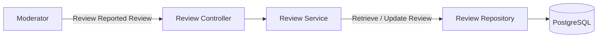

### 4.4 Report Management

**Overview**

The Report Management component allows customers and vendors to report
restaurants, reviews, media, or other users that violate the platform's
policies. It manages the complete reporting process from submission to
resolution.

**Design**

When a report is submitted, the component verifies that the request satisfies
the reporting rules before creating a new report.

Every valid report is assigned a **Pending** status and becomes available for
moderator review. After the investigation is completed, the report status is
updated and the moderation decision is recorded.

**Reporting Rules**

The component enforces the following rules:

- Customers may submit reports.
- Vendors may also submit reports.
- Users cannot report their own restaurants.
- Users cannot report their own reviews.
- Duplicate reports for the same target by the same user are not permitted.
- Every report is created with a **Pending** status.

**Report Status**

A report progresses through the following states:

- Pending
- Under Review
- Resolved
- Rejected

**Interactions**

The component interacts with:

- User Management
- Restaurant Management
- Media Moderation
- Review Moderation
- Database

**Component Diagram**

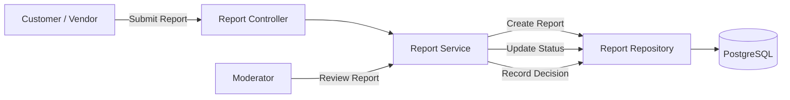

### 4.5 Customer Support Management

**Overview**

The Customer Support Management component manages support requests submitted by
customers and vendors. It enables moderators to review, respond to, and resolve
support requests.

**Design**

When a support request is submitted, the system creates a support ticket with a
**Pending** status.

Moderators review the request, communicate with the requester when necessary,
and record the final resolution before closing the ticket.

**Support Ticket Status**

A support ticket progresses through the following states:

- Pending
- In Progress
- Resolved
- Closed

**Interactions**

The component interacts with:

- User Management
- Restaurant Management
- Database

**Component Diagram**

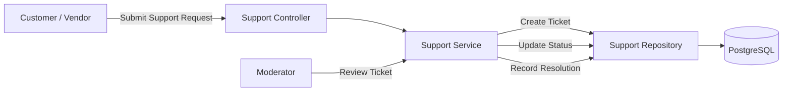

## 5. Database Design

This section describes the database design of the Moderation System. The system
uses PostgreSQL to store moderation-related data and maintains relationships
with entities managed by other subsystems.

The Moderation System owns only moderation-specific data, while entities such as
users, restaurants, reviews, and media are managed by their respective
subsystems. The Moderation System references these entities when performing
moderation operations.

### 5.1 Database Overview

The database stores information required to support moderation activities,
including reports, customer support requests, and moderation records.

The system also interacts with shared entities from other subsystems, such as:

- User
- Restaurant
- Review
- Media

These shared entities are referenced by the Moderation System and may have
moderation-related attributes updated, such as verification or validity status,
when permitted by the corresponding subsystem.

### 5.2 Entity Relationship Diagram

The following Entity Relationship Diagram (ERD) illustrates the primary entities
managed by the Moderation System and their relationships with shared entities
from other subsystems.

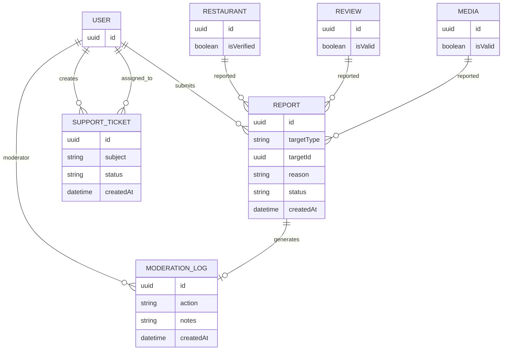

### 5.3 Entity Design

This section describes the primary entities used by the Moderation System. Each
entity represents a specific type of moderation data and defines the information
required to support moderation operations.

#### Report

The Report entity stores reports submitted by customers and vendors against
restaurants, reviews, media, or other users. Each report contains information
about the reported resource, the reporting user, the reason for the report, and
its current status.

**Relationships**

- References one User.
- References one reported resource.
- May be associated with one moderation decision.

---

#### Support Ticket

The Support Ticket entity stores customer support requests submitted by
customers and vendors. It records the request details, current status, assigned
moderator, and the final resolution.

**Relationships**

- References one User.
- May be assigned to one Moderator.

---

#### Restaurant

The Restaurant entity is managed by the Restaurant Management System. The
Moderation System references this entity to update the restaurant's verification
status when the verification criteria are satisfied.

**Relationships**

- Referenced by Report.
- Referenced by Restaurant Verification.

---

#### Review

The Review entity is managed by the Review Management System. The Moderation
System references reviews during moderation and report processing.

**Relationships**

- Referenced by Report.
- Referenced by Review Moderation.

---

#### Media

The Media entity is managed by the Media Management System. The Moderation
System references uploaded media when moderation actions are performed.

**Relationships**

- Referenced by Report.
- Referenced by Media Moderation.

---

#### User

The User entity is managed by the User Management System. The Moderation System
references users when processing reports, customer support requests, and
moderation activities.

**Relationships**

- Creates Reports.
- Creates Support Tickets.
- Performs Moderation Actions.

## 6. API Design

This section describes the REST APIs exposed by the Moderation System. The APIs
enable communication between the client application and the backend services
while enforcing authentication and authorization requirements.

All requests and responses use the JSON format and follow RESTful design
principles.

### 6.1 API Overview

The Moderation System exposes endpoints for the following components:

- Restaurant Verification
- Media Moderation
- Review Moderation
- Report Management
- Customer Support Management

Each endpoint is responsible for a single operation and returns standard HTTP
status codes to indicate the outcome of the request.

### 6.2 Authentication

All moderation APIs require authentication using JSON Web Tokens (JWT). Access
to protected endpoints is restricted according to the authenticated user's role.

The Moderation System supports the following roles:

- Customer
- Vendor
- Moderator
- Administrator

Role-based authorization is enforced before any moderation operation is
performed.

### 6.3 Restaurant Verification API

The Restaurant Verification API automatically updates a restaurant's
verification status when the verification criteria are satisfied.

| Method | Endpoint                   | Description                                 |
| ------ | -------------------------- | ------------------------------------------- |
| PATCH  | `/restaurants/{id}/verify` | Updates the restaurant verification status. |

### 6.4 Media Moderation API

The Media Moderation API provides endpoints for reviewing and managing media
uploaded by customers and vendors. Authorized moderators can approve or remove
media that violates the platform's moderation policies.

| Method | Endpoint                 | Description                        |
| ------ | ------------------------ | ---------------------------------- |
| GET    | `/moderation/media`      | Retrieve media pending moderation. |
| GET    | `/moderation/media/{id}` | Retrieve media details.            |
| PATCH  | `/moderation/media/{id}` | Update the moderation status.      |
| DELETE | `/moderation/media/{id}` | Remove media from the platform.    |

**Response Codes**

| Code | Description                     |
| ---- | ------------------------------- |
| 200  | Request completed successfully. |
| 400  | Invalid request data.           |
| 401  | Authentication required.        |
| 403  | Insufficient permissions.       |
| 404  | Media not found.                |
| 500  | Internal server error.          |

### 6.5 Review Moderation API

The Review Moderation API provides endpoints for reviewing and managing customer
reviews. Authorized moderators can approve, update, or remove reviews that
violate the platform's moderation policies.

| Method | Endpoint                   | Description                          |
| ------ | -------------------------- | ------------------------------------ |
| GET    | `/moderation/reviews`      | Retrieve reviews pending moderation. |
| GET    | `/moderation/reviews/{id}` | Retrieve review details.             |
| PATCH  | `/moderation/reviews/{id}` | Update the moderation status.        |
| DELETE | `/moderation/reviews/{id}` | Remove a review from the platform.   |

### 6.6 Report Management API

The Report Management API provides endpoints for submitting, retrieving, and
managing reports submitted by customers and vendors.

| Method | Endpoint                   | Description                 |
| ------ | -------------------------- | --------------------------- |
| POST   | `/reports`                 | Submit a new report.        |
| GET    | `/moderation/reports`      | Retrieve submitted reports. |
| GET    | `/moderation/reports/{id}` | Retrieve report details.    |
| PATCH  | `/moderation/reports/{id}` | Update the report status.   |

### 6.7 Customer Support Management API

The Customer Support Management API provides endpoints for creating, tracking,
and resolving customer support requests.

| Method | Endpoint        | Description                       |
| ------ | --------------- | --------------------------------- |
| POST   | `/support`      | Create a support request.         |
| GET    | `/support`      | Retrieve support requests.        |
| GET    | `/support/{id}` | Retrieve support request details. |
| PATCH  | `/support/{id}` | Update the support ticket status. |
| DELETE | `/support/{id}` | Close a support request.          |

## 7. Security Design

This section describes the security mechanisms used by the Moderation System to
protect data and restrict access to authorized users.

### 7.1 Authentication

The Moderation System authenticates users using JSON Web Tokens (JWT). Every
protected request must include a valid authentication token before access to
moderation resources is granted.

Unauthenticated requests to protected endpoints are rejected.

### 7.2 Authorization

Role-based access control (RBAC) is used to restrict access to moderation
functionality.

The system supports the following roles:

- Customer
- Vendor
- Moderator
- Administrator

Each role is granted only the permissions required to perform its assigned
responsibilities.

### 7.3 Input Validation

All incoming requests are validated before being processed.

The Moderation System validates:

- Required fields
- Data types
- Input formats
- Business rules

Invalid requests are rejected before reaching the business logic.

### 7.4 Data Protection

Sensitive data is transmitted using HTTPS.

The system protects stored data through database constraints, application-level
validation, and controlled access to moderation resources.

Only authorized users are permitted to access or modify moderation records.

## 8. Detailed Design

This section presents the detailed design of the Moderation System using Unified
Modeling Language (UML) diagrams. These diagrams illustrate the static structure
and dynamic behavior of the major system components.

The diagrams complement the architectural design presented in the previous
sections by providing a detailed view of component relationships, interactions,
workflows, and state transitions.

### 8.1 Class Diagram

The following class diagram illustrates the primary software classes of the
Moderation System and their relationships. The diagram focuses on the
interaction between controllers, services, repositories, and the database layer.

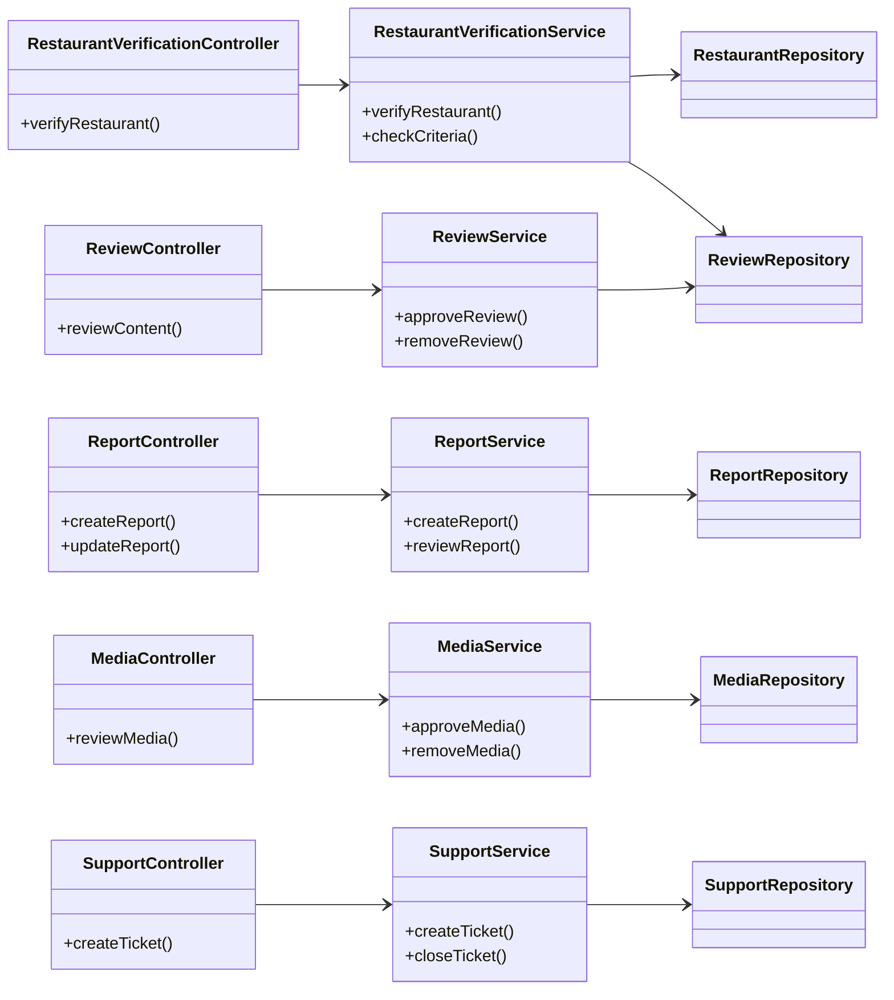

### 8.2 Sequence Diagrams

The following sequence diagrams illustrate the interactions between the actors
and software components during the execution of the primary workflows in the
Moderation System.

#### 8.2.1 Restaurant Verification

This sequence diagram illustrates the process of automatically verifying a
restaurant after a customer submits a review.

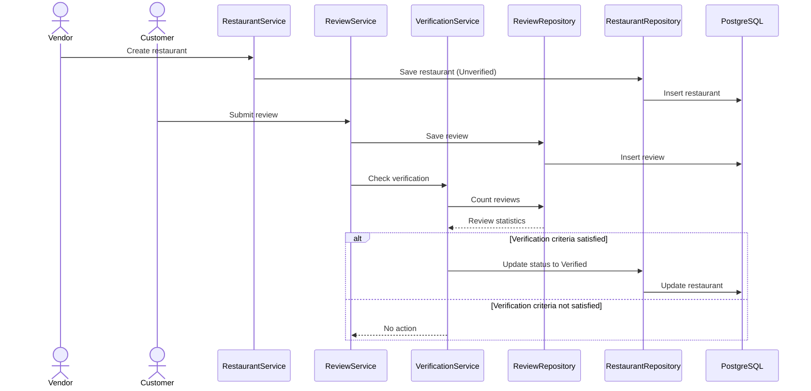

#### 8.2.2 Media Moderation

This sequence diagram illustrates the moderation workflow for uploaded media.


#### 8.2.3 Review Moderation

This sequence diagram illustrates the moderation workflow for customer reviews.

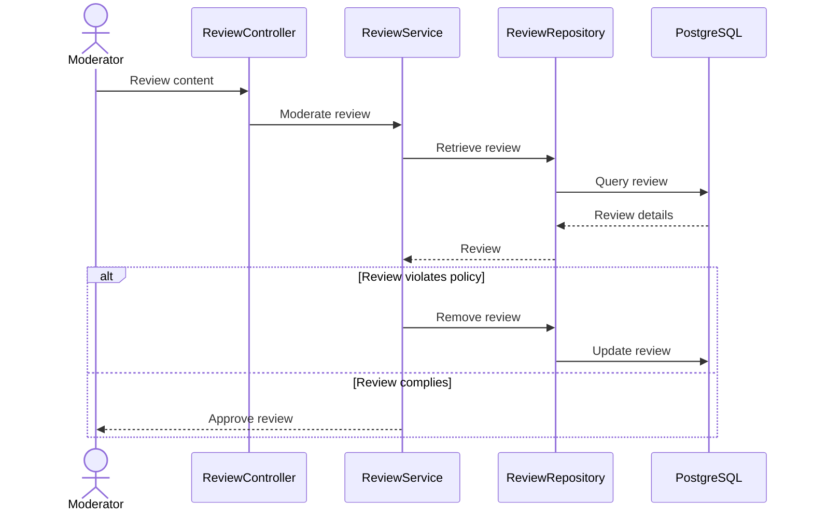

#### 8.2.4 Report Management

This sequence diagram illustrates the workflow for submitting and processing a
report.

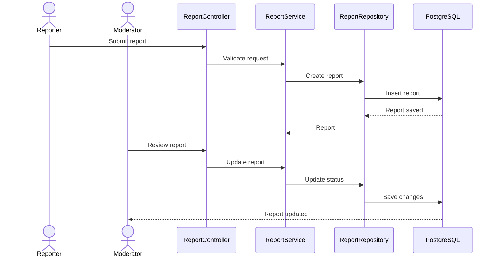

#### 8.2.5 Customer Support Management

This sequence diagram illustrates the workflow for creating and resolving a
customer support request.

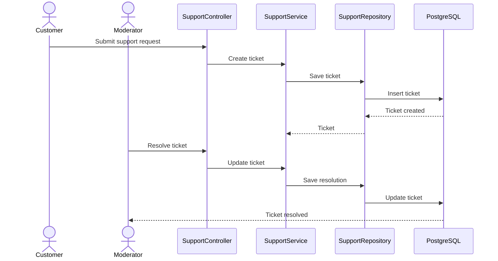

### 8.3 Activity Diagrams

The following activity diagrams illustrate the workflow of the primary
moderation processes. Each diagram shows the sequence of activities, decision
points, and possible execution paths.

#### 8.3.1 Restaurant Verification

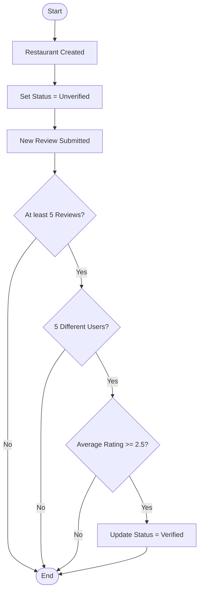

#### 8.3.2 Media Moderation

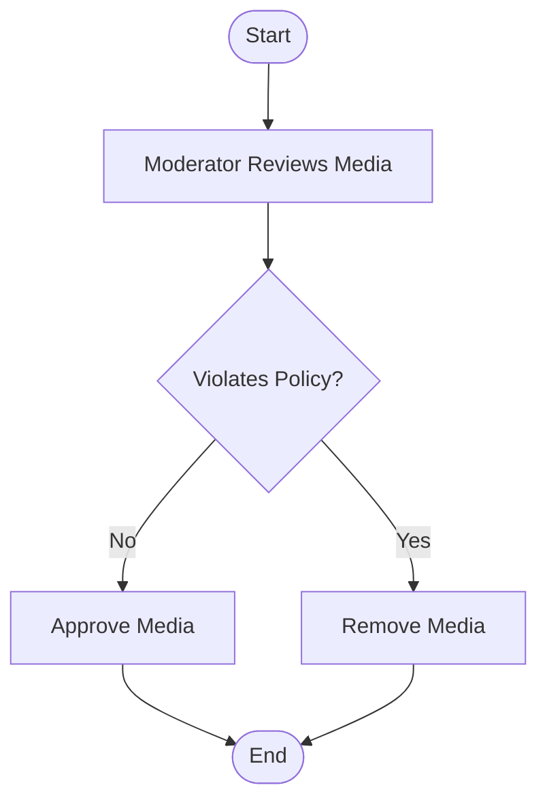

#### 8.3.3 Review Moderation

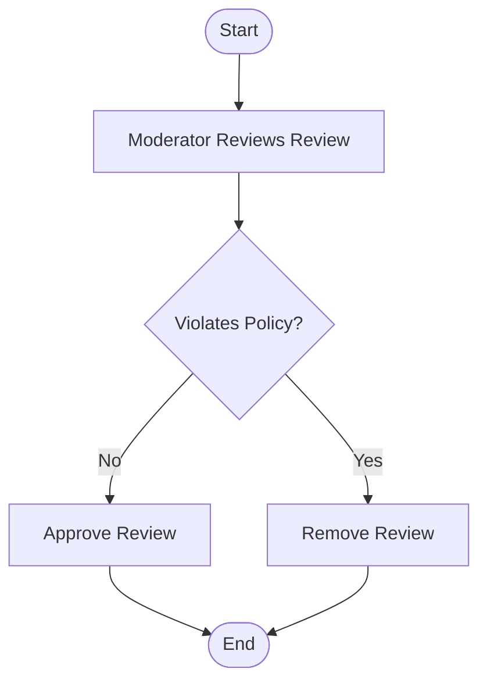

#### 8.3.4 Report Management

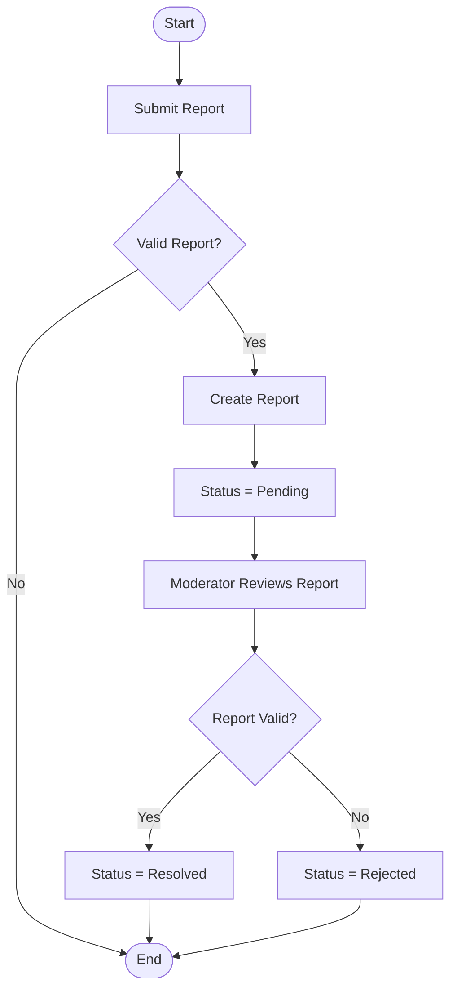

#### 8.3.5 Customer Support Management

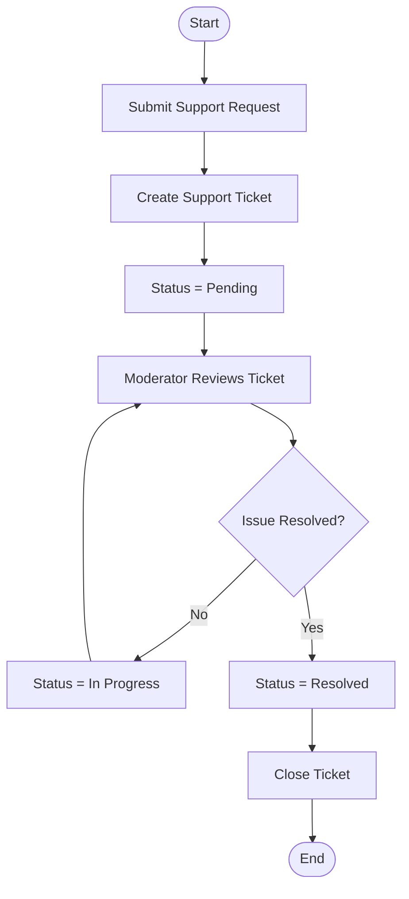

### 8.4 State Diagrams

The following state diagrams illustrate how the primary moderation entities
transition between different states during their lifecycle.

#### 8.4.1 Restaurant Verification State Diagram

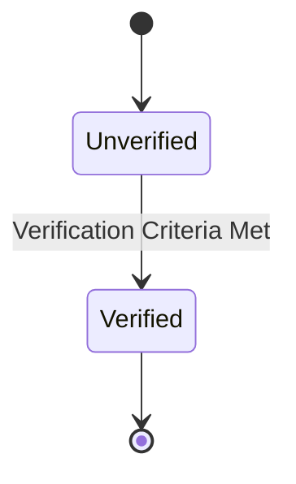

#### 8.4.2 Report State Diagram

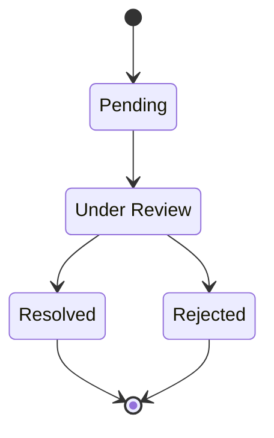

#### 8.4.3 Customer Support State Diagram

```mermaid
stateDiagram-v2

    state "In Progress" as InProgress

    [*] --> Pending

    Pending --> InProgress

    InProgress --> Resolved

    Resolved --> Closed

    Closed --> [*]
```

## 9. Error Handling and Logging

This section describes how the Moderation System handles errors and records
system events.

### 9.1 Error Handling

The Moderation System validates all incoming requests before processing them.
Invalid requests result in appropriate HTTP error responses.

Common error responses include:

| Status Code | Description           |
| ----------- | --------------------- |
| 400         | Bad Request           |
| 401         | Unauthorized          |
| 403         | Forbidden             |
| 404         | Resource Not Found    |
| 409         | Conflict              |
| 500         | Internal Server Error |

### 9.2 Logging

The system records important events to support debugging and system monitoring.

Examples include:

- User authentication events.
- Restaurant verification.
- Report creation.
- Moderation actions.
- Customer support activities.
- Unexpected system errors.

## 10. Future Enhancements

The current design provides the core functionality required by the Moderation
System. Future enhancements may include:

- AI-assisted content moderation.
- Automatic spam detection.
- Advanced moderation analytics.
- Real-time moderator notifications.
- Enhanced moderation dashboards.
- Integration with external moderation services.
