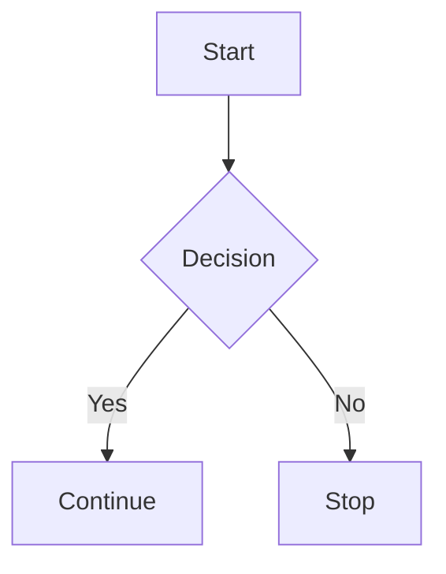

# Markdown Phase 1 Cheat Sheet

This document demonstrates common Markdown syntax and what it looks like
when rendered.

------------------------------------------------------------------------

# Heading 1

## Heading 2

### Heading 3

#### Heading 4

##### Heading 5

###### Heading 6

------------------------------------------------------------------------

## Paragraphs

This is the first paragraph.

This is the second paragraph.

------------------------------------------------------------------------

## Bold, Italic and Strikethrough

**Bold**

*Italic*

***Bold Italic***

~~Strikethrough~~

------------------------------------------------------------------------

## Blockquotes

> This is a blockquote.
>
> It can span multiple lines.

> Nested \> Second level

------------------------------------------------------------------------

## Unordered List

- Apple
- Banana
- Orange

Nested:

- Backend
  - Express
  - Prisma

------------------------------------------------------------------------

## Ordered List

1. Install
2. Configure
3. Deploy

------------------------------------------------------------------------

## Task List

- [x] Login
- [ ] Register
- [ ] Forgot Password

------------------------------------------------------------------------

## Horizontal Rule

------------------------------------------------------------------------

## Inline Code

Use `npm install`.

------------------------------------------------------------------------

## Code Block

``` ts
function hello(name: string) {
  console.log(`Hello ${name}`);
}
```

------------------------------------------------------------------------

## Link

[GitHub](https://github.com)

------------------------------------------------------------------------

## Image

``` md

```

*(Replace `logo.png` with your own image path.)*

------------------------------------------------------------------------

## Table

  Name     Age Country
  ------ ----- ---------
  John      20 Canada
  Jane      21 USA

------------------------------------------------------------------------

## Escaping Characters

\\*Not italic\\*

------------------------------------------------------------------------

## Emoji

😀 🚀 🎉

GitHub shortcode:

`:smile:`

------------------------------------------------------------------------

## Footnote

Markdown supports footnotes.[^1]

------------------------------------------------------------------------

## HTML

<div style="padding:8px;border:1px solid #999;">
<b>HTML works inside Markdown on many platforms.</b>
</div>

------------------------------------------------------------------------

## Table Alignment

  Left    Center    Right
  ------ -------- -------
  A         B           C
  1         2           3

------------------------------------------------------------------------

## Collapsible Section

```{=html}
<details>
```

```{=html}
<summary>
```

Click to expand

```{=html}
</summary>
```

Hidden content goes here.

```{=html}
</details>
```

------------------------------------------------------------------------

## Badge


------------------------------------------------------------------------

## Table of Contents

- [Heading 1](#heading-1)
- [Paragraphs](#paragraphs)
- [Table](#table)

------------------------------------------------------------------------

## HTML Comment

```{=html}
<!-- This comment is hidden when rendered -->
```

------------------------------------------------------------------------

## Mermaid Example



[^1]: This is the footnote.
